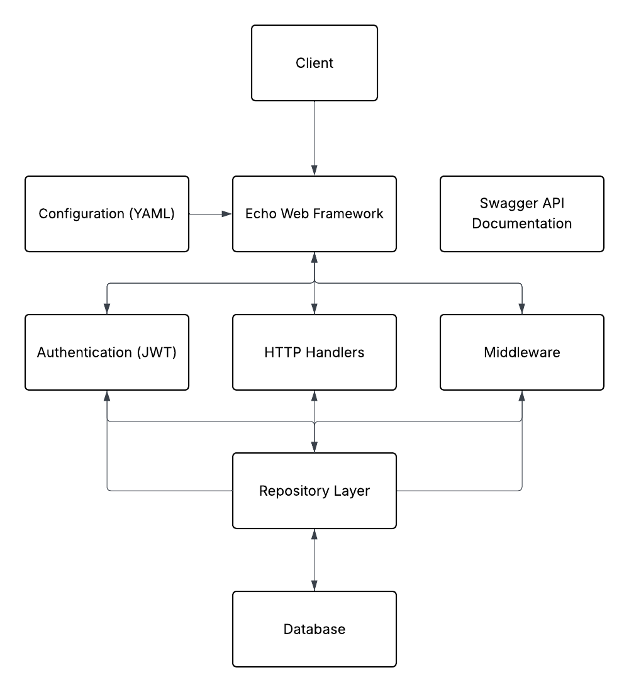

## Asumsi-Asumsi

1. **Autentikasi:**

   - Menggunakan JWT (JSON Web Token) untuk autentikasi
   - Token berlaku selama 24 jam
   - Memiliki dua peran pengguna: customer dan admin

2. **Database:**

   - Menggunakan PostgreSQL sebagai database
   - Menggunakan library pq untuk koneksi database
   - Mengimplementasikan connection pooling untuk efisiensi

3. **Keamanan:**

   - Password dihash menggunakan bcrypt
   - Semua endpoint sensitif dilindungi dengan middleware autentikasi
   - Implementasi CORS untuk keamanan browser

4. **Fitur E-Commerce:**

   - Pengguna dapat melihat produk tanpa login
   - Untuk menambahkan item ke keranjang, pengguna harus login
   - Hanya admin yang dapat menambah, mengupdate, atau menghapus produk
   - Order dapat dibuat dari item yang ada di keranjang

5. **Lingkungan:**
   - Aplikasi dapat dikonfigurasi melalui file config.yaml
   - Aplikasi dapat di-deploy menggunakan Docker
   - Lingkungan pengembangan menggunakan Go versi 1.20

## Arsitektur

Aplikasi mengikuti arsitektur berlapis seperti yang ditunjukkan di bawah ini:



### Komponen:

- **Echo Web Framework**: Menangani routing HTTP dan eksekusi middleware
- **Konfigurasi**: Konfigurasi berbasis YAML untuk aplikasi
- **Autentikasi**: Sistem autentikasi berbasis JWT
- **Handler**: Memproses permintaan HTTP dan menghasilkan respons
- **Middleware**: Menyediakan fitur seperti autentikasi, logging
- **Layer Repository**: Mengabstraksi operasi database
- **Database PostgreSQL**: Menyimpan semua data aplikasi

## Setup dan Instalasi

### Prasyarat

- Go 1.20 atau lebih baru
- PostgreSQL
- Docker (opsional)

### Menjalankan Aplikasi Secara Lokal

1. Clone repositori
2. Salin `.env.example` ke `.env` dan sesuaikan dengan lingkungan Anda
3. Buat database PostgreSQL
4. Jalankan migrasi database (file SQL tersedia di direktori `migrations`)
5. Jalankan aplikasi:
   ```bash
   go run cmd/server/main.go
   ```

## Setup dan Instalasi

### Prasyarat

- Go 1.20 atau lebih baru
- PostgreSQL
- Docker (opsional)

### Menjalankan Aplikasi Secara Lokal

1. Clone repositori
2. Salin `.env.example` ke `.env` dan sesuaikan dengan lingkungan Anda
3. Buat database PostgreSQL
4. Jalankan migrasi database (file SQL tersedia di direktori `migrations`)
5. Jalankan aplikasi:
   ```bash
   go run cmd/server/main.go
   ```

### Menjalankan dengan Docker

1. Build image Docker:

   ```bash
   docker build -t test-ordent .
   ```

2. Jalankan container:
   ```bash
   docker run -p 8080:8080 --env-file .env test-ordent
   ```

## API Endpoints

### Autentikasi

- `POST /api/auth/login` - Login pengguna
- `POST /api/auth/register` - Registrasi pengguna baru

### Produk

- `GET /api/products` - Mendapatkan daftar produk (publik)
- `GET /api/products/{id}` - Mendapatkan detail produk (publik)
- `POST /api/products` - Menambahkan produk baru (admin)
- `PUT /api/products/{id}` - Mengupdate produk (admin)
- `DELETE /api/products/{id}` - Menghapus produk (admin)

### Keranjang

- `GET /api/cart` - Mendapatkan keranjang belanja (login)
- `POST /api/cart/items` - Menambahkan item ke keranjang (login)
- `DELETE /api/cart/items/{id}` - Menghapus item dari keranjang (login)

### Order

- `POST /api/orders` - Membuat order baru dari keranjang (login)
- `GET /api/orders` - Mendapatkan daftar order (login)

## Dokumentasi API

Dokumentasi API tersedia menggunakan Swagger di `/api/swagger/index.html`
